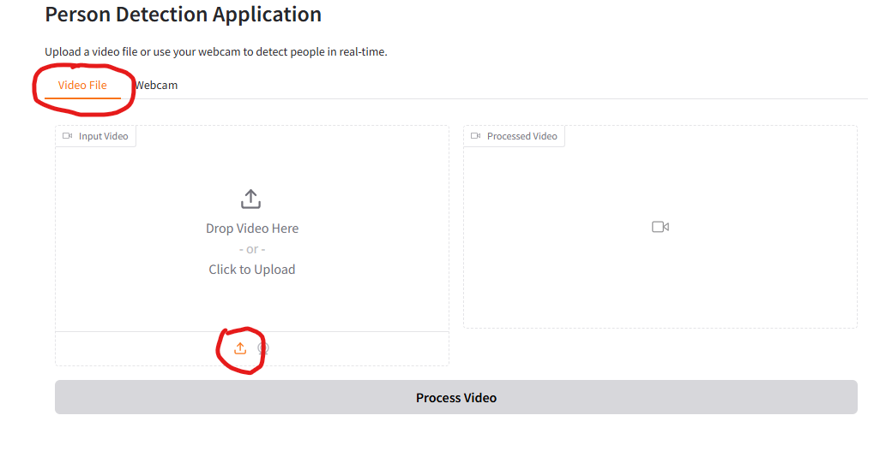
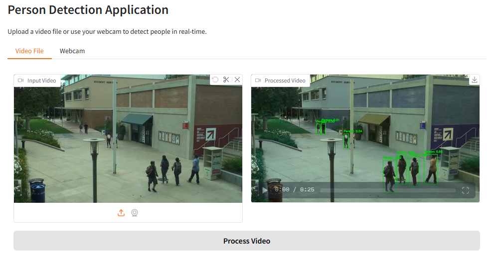
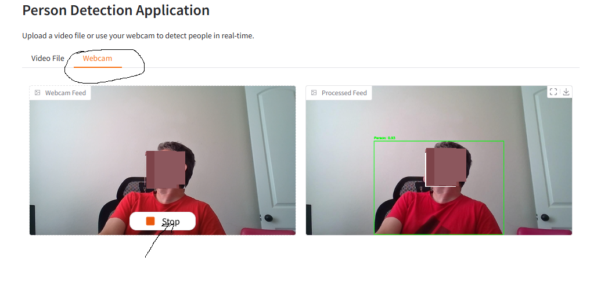

# Video Analysis

## Objective
This personal project aims to create detection helpers for future projects. The application enables the detection of people using [YOLOv5n](https://docs.ultralytics.com/models/yolov5/). You do not need to download the model manually; it will be downloaded automatically the first time the application runs. Ensure you have access to [Hugging Face](https://huggingface.co/).

## Requirements
- Python 3.10 or later
- NVIDIA or AMD GPU (it works with CPU though slowly)

## Setup

### Create and Activate Virtual Environment

#### On Linux
```bash
python3 -m venv venv
source venv/bin/activate
```

#### On Windows
```bash
python -m venv venv
.\venv\Scripts\activate
```

### Install Dependencies
```bash
pip install -r requirements.txt
```

## Running the Application

### Activate Virtual Environment

#### On Linux
```bash
source venv/bin/activate
```

#### On Windows
```bash
.\venv\Scripts\activate
```

### Run the Application
```bash
python web-analyze-video.py
```
### The Gradio Local and Public URLs
- Local URL: ```http://localhost:7860```
- Public URL: it is different every time and look like this:
```https://<random-hex-umber>.gradio.live``` and it is valid for 72 hours only. It can be accessed anywhere.

### Problem with Share=True in Windows
It is possible that you firewall/antivirus wrongly flag the reverse proxy application in Gradio as malware. You have the option of changing the server lauch code from:
```python
app.launch(share=True)
```
To:
```python
app.launch(share=False)
```

Conversely you can configure your firewall/antivirus to ignore this application. See this:
[Gradio Security Advise](https://github.com/gradio-app/gradio/security/advisories/GHSA-279j-x4gx-hfrh)

### How to Deactivate Virtual Environment after use
```bash
deactivate
```
## The Application Layout

### Video File
You may use the video from VIRAT that I conveniently added to the project in folder ```samplevideo```. You may find other videos at [VIRAT Database](https://viratdata.org/)

Drag and drop the file or click the upload button.



Then press the huge Process Video button and wait for the analysis. The video on the right will contain the processed video adding a bounding box around any person detected.



### Webcam
The other tab allows the real time detection of people using the same bounding box. It will ask you for permission to access you camera. You need to press the Record button to start the detection. You may use the Stop button to stop the live feeding.



